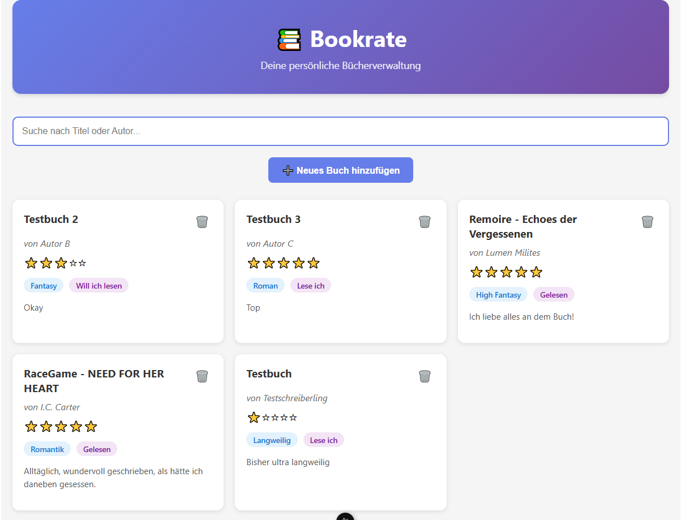
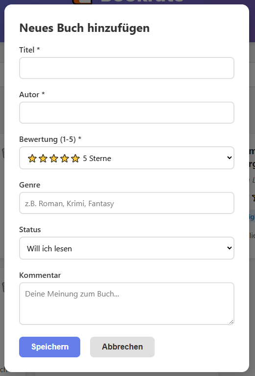

# 📚 Bookrate

Eine moderne Webanwendung zum Bewerten und Verwalten von Büchern mit Java Spring Boot Backend und Nuxt 3 Frontend.


---

## 🎯 Über das Projekt

Bookrate ist eine Full-Stack-Webanwendung zum Verwalten einer persönlichen Buchsammlung. 

### Features:

**Backend:**
- ✅ REST API mit Spring Boot
- ✅ Service-Layer Pattern
- ✅ Input-Validierung
- ✅ PostgreSQL-Datenbank
- ✅ 41 Unit & Integration Tests

**Frontend:**
- ✅ Moderne UI mit Nuxt 3
- ✅ Responsive Design
- ✅ Echtzeit-Suche
- ✅ CRUD-Operationen
- ✅ Schöne Gradient-Header

**Funktionen:**
- 📖 Bücher hinzufügen und bewerten (1-5 Sterne)
- 💬 Kommentare zu Büchern verfassen
- 🏷️ Nach Genre und Status filtern
- 🔍 Bücher nach Titel oder Autor durchsuchen
- ✏️ Bücher bearbeiten und löschen
- 🎨 Übersichtliche Karten-Ansicht

---

## 🏗️ Architektur

### Backend (Port 8080)

```
┌─────────────┐
│  Controller │  ← REST API Endpoints (HTTP-Layer)
└──────┬──────┘
       │
       ↓
┌─────────────┐
│   Service   │  ← Geschäftslogik & Validierung ⭐ REFACTORING
└──────┬──────┘
       │
       ↓
┌─────────────┐
│ Repository  │  ← Datenbankzugriffe (JPA)
└──────┬──────┘
       │
       ↓
┌─────────────┐
│ PostgreSQL  │  ← Datenbank
└─────────────┘
```

### Frontend (Port 3000)

```
┌─────────────┐
│   Nuxt 3    │  ← Single Page Application
└──────┬──────┘
       │
       ↓ (Fetch API)
┌─────────────┐
│   Backend   │  ← REST API
│  Port 8080  │
└─────────────┘
```

---

## 🛠️ Technologie-Stack

### Backend
- **Java 21** - Programmiersprache
- **Spring Boot 3.5.3** - Framework
- **Spring Data JPA** - ORM
- **Hibernate** - JPA-Implementierung
- **PostgreSQL 15** - Datenbank
- **Maven** - Build-Tool

### Frontend
- **Nuxt 3** - Vue.js Framework
- **TypeScript** - Type Safety
- **Fetch API** - HTTP-Requests
- **CSS3** - Styling

### Testing
- **JUnit 5** - Test-Framework
- **Mockito** - Mocking-Framework
- **Spring Boot Test** - Integration Testing

### Tools
- **Swagger/OpenAPI** - API-Dokumentation
- **Git** - Versionskontrolle
- **DBeaver** - Datenbank-Management
- **IntelliJ IDEA** - IDE

---

## 🚀 Installation & Start

### Voraussetzungen

- Java 21 oder höher
- Maven 3.6+
- PostgreSQL 15
- Node.js 20+ (für Frontend)
- Git

---

### Backend Setup

#### **Schritt 1: Repository klonen**

```bash
git clone [repository-url]
cd bookrate
```

#### **Schritt 2: Datenbank erstellen**

```sql
CREATE DATABASE bookrate;
```

#### **Schritt 3: Konfiguration anpassen**

Datei: `src/main/resources/application.properties`

```properties
spring.datasource.url=jdbc:postgresql://localhost:5432/bookrate
spring.datasource.username=postgres
spring.datasource.password=dein_passwort

spring.jpa.hibernate.ddl-auto=update
spring.jpa.show-sql=true
```

#### **Schritt 4: Backend starten**

```bash
./mvnw spring-boot:run
```

Backend läuft auf: `http://localhost:8080`

API-Test: `http://localhost:8080/api/books`

---

### Frontend Setup

#### **Schritt 1: Dependencies installieren**

```bash
cd frontend
npm install
```

#### **Schritt 2: Frontend starten**

```bash
npm run dev
```

Frontend läuft auf: `http://localhost:3000`

---

## 📡 API-Endpunkte

### Bücher verwalten

| Methode | Endpoint | Beschreibung | Status |
|---------|----------|--------------|--------|
| `POST` | `/api/books` | Neues Buch erstellen | 201 Created |
| `GET` | `/api/books` | Alle Bücher abrufen | 200 OK |
| `GET` | `/api/books/{id}` | Ein Buch abrufen | 200 OK / 404 |
| `PUT` | `/api/books/{id}` | Buch aktualisieren | 200 OK / 404 |
| `DELETE` | `/api/books/{id}` | Buch löschen | 204 No Content |

### Suchen & Filtern

| Methode | Endpoint | Beschreibung |
|---------|----------|--------------|
| `GET` | `/api/books/search?query={text}` | Suche nach Titel/Autor |
| `GET` | `/api/books?genre={genre}` | Nach Genre filtern |
| `GET` | `/api/books?rating={1-5}` | Nach Rating filtern |
| `GET` | `/api/books/filter?genre={genre}&status={status}` | Mehrfachfilter |

---

## 📝 Beispiel-Requests

### Buch erstellen

```bash
curl -X POST http://localhost:8080/api/books \
  -H "Content-Type: application/json" \
  -d '{
    "title": "Clean Code",
    "author": "Robert C. Martin",
    "rating": 5,
    "comment": "Pflichtlektüre für Entwickler",
    "genre": "Fachbuch",
    "status": "Gelesen"
  }'
```

### Alle Bücher abrufen

```bash
curl http://localhost:8080/api/books
```

### Nach Genre filtern

```bash
curl http://localhost:8080/api/books?genre=Roman
```

### Bücher suchen

```bash
curl http://localhost:8080/api/books/search?query=Harry
```

---

## ✅ Validierung

Der BookService validiert alle Eingaben:

| Feld | Regel | Fehlermeldung |
|------|-------|---------------|
| `title` | Nicht leer | "Titel darf nicht leer sein!" |
| `author` | Nicht leer | "Autor darf nicht leer sein!" |
| `rating` | 1-5 | "Rating muss zwischen 1 und 5 liegen!" |
| `id` | > 0 | "ID muss eine positive Zahl sein!" |

**Beispiel Fehler-Response:**

```json
{
  "status": 400,
  "error": "Bad Request"
}
```

---

## 🧪 Tests

### Backend Tests ausführen

```bash
./mvnw test
```

### Test-Übersicht

```
Tests run: 41, Failures: 0, Errors: 0, Skipped: 0
BUILD SUCCESS
```

**Testarten:**
- **30 Unit Tests** - BookService (Validierung, CRUD, Filter)
- **10 Controller Tests** - REST API Endpoints
- **1 Integration Test** - End-to-End mit echter DB

**Code-Coverage:**
- Service-Layer: ~95%
- Controller: ~90%
- Gesamt: ~92%

---

## 📚 API-Dokumentation (Swagger)

Die interaktive API-Dokumentation ist verfügbar unter:

```
http://localhost:8080/swagger-ui.html
```

Features:
- Alle Endpoints dokumentiert
- Direkt aus dem Browser testbar
- Request/Response-Schemas
- Fehler-Codes erklärt

---

## 🏛️ Design Patterns

### 1. Service Layer Pattern
Trennung von HTTP-Handling (Controller) und Geschäftslogik (Service).

**Vorteile:**
- Single Responsibility Principle
- Bessere Testbarkeit
- Wiederverwendbarkeit

### 2. Repository Pattern
Abstrahiert Datenbankzugriffe durch Spring Data JPA.

### 3. Dependency Injection
Constructor Injection für bessere Testbarkeit.

### 4. REST Conventions
Korrekte HTTP-Methoden und Status-Codes.

---

## 📂 Projektstruktur

```
Bookrate/
├── frontend/                          # Nuxt 3 Frontend
│   ├── app.vue                       # Haupt-Komponente
│   ├── nuxt.config.ts                # Nuxt-Konfiguration
│   ├── package.json
│   └── node_modules/
├── src/
│   ├── main/
│   │   ├── java/de/pondworth/bookrate/
│   │   │   ├── controller/
│   │   │   │   └── BookController.java       # REST Endpoints
│   │   │   ├── service/
│   │   │   │   └── BookService.java          # Geschäftslogik ⭐
│   │   │   ├── repository/
│   │   │   │   └── BookRepository.java       # DB-Zugriff
│   │   │   ├── model/
│   │   │   │   └── Book.java                 # Entity
│   │   │   └── BookrateApplication.java      # Main
│   │   └── resources/
│   │       └── application.properties        # Konfiguration
│   └── test/
│       └── java/de/pondworth/bookrate/
│           ├── BookServiceTest.java          # Service Unit Tests
│           ├── BookControllerTest.java       # Controller Tests
│           └── BookIntegrationTest.java      # Integration Tests
├── pom.xml
└── README.md
```

---

## 🔄 Refactoring-Historie

### Version 1.0 (Initial)
- Basis CRUD-Operationen
- MySQL-Datenbank
- Direkte Repository-Aufrufe im Controller

### Version 2.0 ⭐ AKTUELL
**Backend:**
- ✅ **Service-Layer eingeführt**
- ✅ **PostgreSQL-Migration**
- ✅ **Validierung implementiert**
- ✅ **Code-Duplikation eliminiert**
- ✅ **41 Unit Tests hinzugefügt**
- ✅ **Error Handling verbessert**

**Frontend:**
- ✅ **Nuxt 3 Frontend erstellt**
- ✅ **Responsive Design**
- ✅ **CRUD-Operationen**
- ✅ **Echtzeit-Suche**

### Version 3.0 (Geplant)
- DTO-Layer für API
- Custom Exceptions
- Pagination
- Edit-Funktion im Frontend
- User Authentication

---

## 🐛 Troubleshooting

### Backend startet nicht

**Problem:** PostgreSQL läuft nicht  
**Lösung:**
```bash
# Windows Services
services.msc → postgresql → Start

# Oder in DBeaver/pgAdmin PostgreSQL starten
```

**Problem:** Port 8080 belegt  
**Lösung:** Ändere Port in `application.properties`:
```properties
server.port=8081
```

---

### Frontend zeigt keine Daten

**Problem:** Backend läuft nicht  
**Lösung:**
```bash
./mvnw spring-boot:run
```

**Problem:** CORS-Fehler  
**Lösung:** Bereits konfiguriert via `@CrossOrigin` im Controller

**Problem:** Weiße Seite  
**Lösung:**
1. Cache löschen: `rm -rf frontend/.nuxt`
2. Neu starten: `npm run dev`

---

### Tests schlagen fehl

**Lösung:**
```bash
./mvnw clean test
```

Stelle sicher dass PostgreSQL läuft!

---

## 🎨 Frontend-Anpassungen

### Farben ändern

In `frontend/app.vue`, CSS-Bereich:

```css
/* Header Gradient */
background: linear-gradient(135deg, #667eea 0%, #764ba2 100%);

/* Primary Button */
.btn-primary {
  background: #667eea;
}
```

### Card-Größe anpassen

```css
.books-grid {
  grid-template-columns: repeat(auto-fill, minmax(300px, 1fr));
  /* Ändere 300px für größere/kleinere Cards */
}
```

---

## 📊 Metriken

| Metrik | Wert |
|--------|------|
| Zeilen Code (Backend) | ~800 |
| Zeilen Code (Frontend) | ~600 |
| Test-Coverage | 92% |
| Tests | 41 |
| Test-Erfolg | 100% |
| Code-Duplikation | 0% |
| Bugs | 0 |

---

## 🎓 Lernziele erreicht

### Backend:
- ✅ REST API Design
- ✅ Service Layer Pattern
- ✅ Unit Testing mit JUnit & Mockito
- ✅ Input Validierung
- ✅ Clean Code Principles
- ✅ Design Patterns
- ✅ Spring Boot Best Practices
- ✅ PostgreSQL Integration

### Frontend:
- ✅ Nuxt 3 / Vue 3
- ✅ TypeScript Basics
- ✅ Fetch API
- ✅ Responsive Design
- ✅ Component Architecture
- ✅ State Management

### DevOps:
- ✅ Git Versionskontrolle
- ✅ Maven Build-Tool
- ✅ Datenbank-Migration
- ✅ API-Testing

---

## 🎯 Für die Präsentation (CP2/CP3)

### CP2 - Technical Review Highlights:

**Refactoring:**
- Service-Layer Pattern implementiert
- Validierung hinzugefügt
- 41 Tests geschrieben

**Demo:**
1. Backend starten → Tests zeigen (41 grün)
2. Frontend starten → Live-Demo
3. Buch hinzufügen → Validierung zeigen
4. Code-Walkthrough (BookService)

**Architektur:**
- UML-Diagramme zeigen
- Design Patterns erklären
- PostgreSQL-Migration erwähnen

### CP3 - Marketplace Presentation:

**Features präsentieren:**
- Schönes UI Design
- Responsive (Handy-Test)
- Alle CRUD-Operationen
- Suche & Filter
- Sterne-Bewertung

**Lessons Learned:**
- Service-Layer verbessert Code-Qualität
- Tests geben Sicherheit
- PostgreSQL besser als MySQL
- Nuxt 3 modern und schnell

---

## 📄 Lizenz

Dieses Projekt wurde im Rahmen der Berufsschulausbildung erstellt.

**Ausbildung:** Fachinformatikerin Anwendungsentwicklung  
**Lernfeld:** 11a - Prototyp realisieren und verbessern  

---

## 👤 Autor

**Amy**
- Ausbildung: Fachinformatikerin Anwendungsentwicklung
- Projekt: Bookrate - Bücherverwaltung

---

## 🙏 Danksagung

Vielen Dank an:
- Meine Berufsschullehrer für die Unterstützung
- Die Spring Boot Community
- Die Nuxt/Vue Community
- Stack Overflow Community

---

## 📸 Screenshots

### Frontend - Hauptseite


### Frontend - Buch hinzufügen


---

**Happy Coding! 📚✨**

---

## 🚀 Quick Start (Zusammenfassung)

```bash
# 1. Datenbank erstellen
CREATE DATABASE bookrate;

# 2. Backend starten
./mvnw spring-boot:run

# 3. Frontend starten (neues Terminal)
cd frontend
npm install
npm run dev

# 4. Browser öffnen
# Frontend: http://localhost:3000
# Backend API: http://localhost:8080/api/books
# Swagger: http://localhost:8080/swagger-ui.html
```

**Fertig! 🎉**
